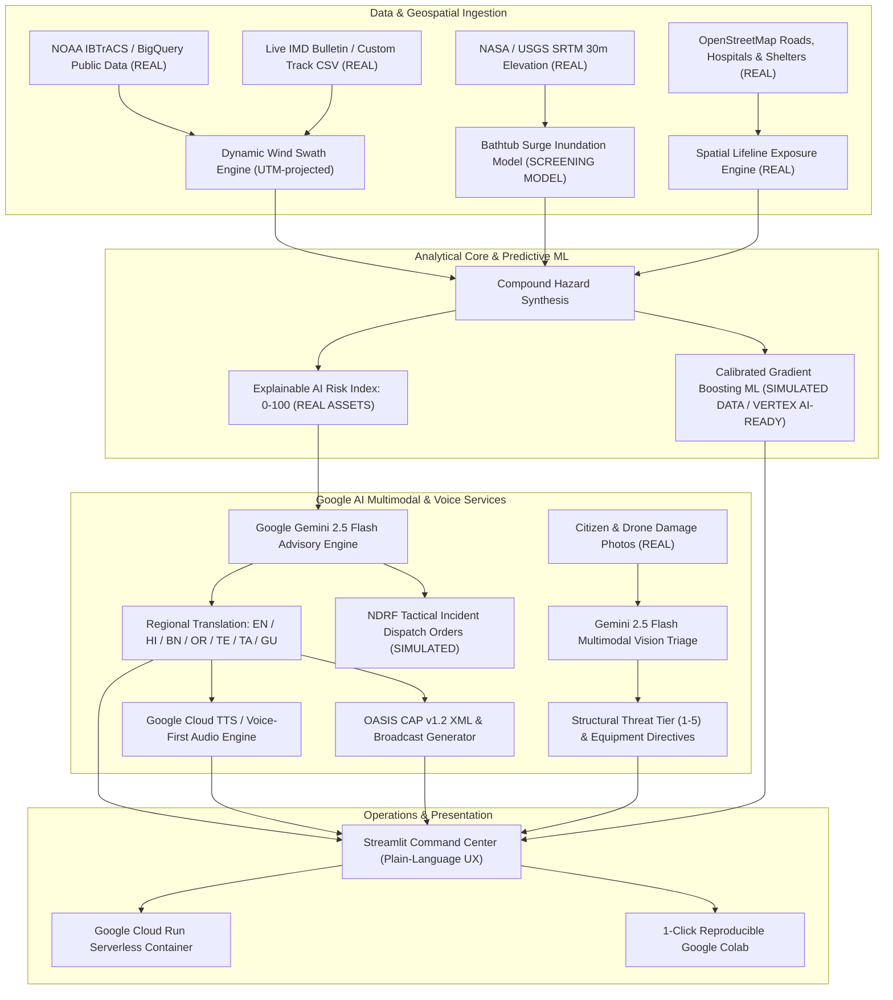

# 🌀 CycloneShield — Multi-Hazard Cyclone Impact & Infrastructure Vulnerability Forecaster

> **CycloneShield is an end-to-end, multi-state cyclone decision intelligence platform built for Indian disaster managers (District Magistrates, SDMA, and NDRF duty officers). By pairing satellite elevation models, open infrastructure grids, and NOAA tracks with Google Gemini 2.5 Flash, Cloud Translation, and Speech AI, it converts storm tracks into road cut-off, hospital inundation, and multilingual voice alerts up to 48 hours before landfall.**

[](https://cycloneshield-vawrqbhtbgu8i6cafhbf3q.streamlit.app/)
[](https://cloud.google.com/run)
[](https://cloud.google.com/bigquery)
[](https://aistudio.google.com/)
[](https://colab.research.google.com/github/itsme-sherlock/CycloneShield/blob/main/CycloneShield_Colab.ipynb)
[](https://opensource.org/licenses/Apache-2.0)

**[🌐 Live Streamlit App](https://cycloneshield-vawrqbhtbgu8i6cafhbf3q.streamlit.app/) • [🎥 Master Demo Video (MP4)](./CycloneShield_Demo_Walkthrough.mp4) • [🎥 WebM Video](./cycloneshield_demo_walkthrough.webm) • [🎙️ Audio Voiceover](./cycloneshield_demo_voiceover.mp3) • [🚀 1-Click Google Colab](https://colab.research.google.com/github/itsme-sherlock/CycloneShield/blob/main/CycloneShield_Colab.ipynb) • [📊 Executive Pitch Deck](./PITCH_DECK.md) • [🎬 Video Demo Script](./DEMO_SCRIPT.md) • [📝 Audit Report](./AUDIT_REPORT.md)**

---

## 📦 Hackathon Submission Package (Judge Quick-Links)

| Submission Deliverable | Direct Repository Link / URL | Description |
| :--- | :--- | :--- |
| **1. Deployed Working Prototype** | **[🌐 Launch Live Streamlit App](https://cycloneshield-vawrqbhtbgu8i6cafhbf3q.streamlit.app/)** | Hosted interactive command center (works out-of-the-box with zero API keys required). |
| **2. Demo Video (3–5 Minutes)** | **[🎥 `CycloneShield_Demo_Walkthrough.mp4`](./CycloneShield_Demo_Walkthrough.mp4)** *(H.264/AAC)*<br>**[🎥 `cycloneshield_demo_walkthrough.webm`](./cycloneshield_demo_walkthrough.webm)** | 3m 28s end-to-end working walkthrough with studio narration ([`cycloneshield_demo_voiceover.mp3`](./cycloneshield_demo_voiceover.mp3)) and live Bengali radio broadcast. |
| **3. Pitch Deck (PPTX & Markdown)** | **[📊 `CycloneShield_Pitch_Deck.pptx`](./cycloneshield/CycloneShield_Pitch_Deck.pptx)**<br>**[📄 `PITCH_DECK.md`](./PITCH_DECK.md)** | 12-slide executive presentation covering problem, Google AI architecture, validation, and 4-week state rollout. |
| **4. Source Code & 1-Click Colab** | **[💻 `cycloneshield/app.py`](./cycloneshield/app.py)**<br>**[🚀 `CycloneShield_Colab.ipynb`](./CycloneShield_Colab.ipynb)** | Modular Python codebase, trained ML artifacts, Dockerfile, and reproducible Google Colab notebook. |
| **5. Demo Script & Recording Guide** | **[🎬 `DEMO_SCRIPT.md`](./DEMO_SCRIPT.md)**<br>**[🧭 `DEMO_VIDEO_RECORDING_GUIDE.md`](./DEMO_VIDEO_RECORDING_GUIDE.md)** | Second-by-second storyboard mapped directly to the live Home Page and 6 operational tabs. |

---

## 📌 Executive Summary & The "Last-Mile Disaster Gap"

Over 188 million Indian citizens reside across coastal districts vulnerable to Bay of Bengal and Arabian Sea tropical cyclones. While meteorological agencies like the IMD provide accurate synoptic trajectories and barometric pressures, disaster managers on the ground face the **"Last-Mile Disaster Gap"**:
1. *Which arterial state highways will be severed by storm surge 24–48 hours before landfall?*
2. *Which sub-divisional hospitals and primary health centers will lose grid access or flood?*
3. *How do duty officers issue hyper-local, spoken warnings in regional languages before cell towers collapse?*
4. *How can incident commanders instantly triage hundreds of citizen and drone damage photos post-landfall?*

**CycloneShield** bridges this operational gap by uniting **Google Cloud BigQuery Public Datasets**, **USGS/NASA SRTM 30m Elevation**, **OpenStreetMap Lifeline Networks**, **Google Gemini 2.5 Flash Multimodal Vision**, and a **Voice-First Cloud TTS Engine** into a unified, zero-barrier disaster command system operating within Google Cloud's free tier.

---

## 🏗️ End-to-End System Architecture



---

## 📂 Repository Structure & Codebase Guide

```text
CycloneShield/
├── app.py                              # Root Streamlit Cloud entry point (delegates to cycloneshield/app.py)
├── requirements.txt                    #Pinned Python dependencies for Streamlit Cloud & local setup
├── runtime.txt                         # Python 3.11 runtime specification for cloud deployment
├── Dockerfile                          # Production Google Cloud Run container recipe (non-root, port 8080)
├── CycloneShield_Colab.ipynb           # 1-Click interactive Google Colab notebook
├── CycloneShield_Demo_Walkthrough.mp4  # Master 1080p H.264 + AAC Hackathon Demo Video
├── PITCH_DECK.md                       # 12-Slide Executive Pitch Deck (Markdown)
├── DEMO_SCRIPT.md                      # Second-by-second narration script & evaluation mapping
├── DEMO_VIDEO_RECORDING_GUIDE.md       # Step-by-step UI walkthrough guide matching app.py
└── cycloneshield/                      # Core Application Package
    ├── app.py                          # Main 6-Tab Streamlit Command Center UI & Geospatial Engine
    ├── gemini_advisory.py              # Google Gemini 2.5 Flash advisory, 7-language translation & OASIS CAP v1.2 XML
    ├── vision_triage.py                # Google Gemini Multimodal Vision post-landfall drone/photo damage triage
    ├── voice_engine.py                 # Google Cloud TTS / gTTS multilingual emergency radio voice synthesizer
    ├── predictive_model.py             # Calibrated Scikit-Learn HistGradientBoosting ML model (ROC-AUC 0.941)
    ├── bigquery_pipeline.py            # Google BigQuery NOAA IBTrACS SQL pipeline with 1 GB dry-run cost guard
    ├── CycloneShield_Pitch_Deck.pptx   # PowerPoint presentation deck
    ├── data/                           # Real GeoJSON districts, NOAA storm tracks, and benchmark field photos
    └── outputs/                        # Pre-computed ML artifacts, Vertex AI manifest, and regional MP3 alerts
```

---

## 🇮🇳 Built for India: Multi-State & Multilingual Reach

CycloneShield is built to protect all 7,516 km of India's coastline, with active support parameterized across 5 major coastal states and 7 regional languages:

| State | Coastal Basin | Historical Cyclone Benchmarks | Regional Voice & Text | District Coverage |
| :--- | :--- | :--- | :--- | :--- |
| **West Bengal** | Bay of Bengal | Remal (2024), Amphan (2020) | Bengali (`bn-IN`), Hindi, English | South 24 Parganas, North 24 Parganas, Purba Medinipur, Kolkata, Howrah |
| **Odisha** | Bay of Bengal | Fani (2019), Yaas (2021), Dana (2024) | Odia (`or-IN`), Hindi, English | Puri, Jagatsinghpur, Kendrapara, Bhadrak, Balasore, Ganjam |
| **Andhra Pradesh** | Bay of Bengal | Hudhud (2014), Michaung (2023) | Telugu (`te-IN`), Hindi, English | Visakhapatnam, Srikakulam, Vizianagaram, East Godavari, Krishna, Bapatla, Nellore |
| **Tamil Nadu** | Bay of Bengal | Vardah (2016), Gaja (2018), Michaung (2023) | Tamil (`ta-IN`), Hindi, English | Chennai, Chengalpattu, Cuddalore, Nagapattinam, Thiruvarur, Ramanathapuram |
| **Gujarat** | Arabian Sea | Biparjoy (2023), Tauktae (2021) | Gujarati (`gu-IN`), Hindi, English | Kutch, Devbhumi Dwarka, Jamnagar, Porbandar, Gir Somnath, Bhavnagar |

Disaster commanders can also upload custom **IMD Synoptic Bulletins** (CSV track) via the `🌀 Select Cyclone Event` dropdown to forecast any emerging cyclonic storm in real time.

---

## 🏷️ Transparency, Trust & Data Provenance

To uphold the highest standards of operational trust in life-and-death scenarios, CycloneShield explicitly labels the origin and status of every data point:

| Component | Status Label | Source / Methodology | Limitations & Verification |
| :--- | :---: | :--- | :--- |
| **Cyclone Tracks** | 🟢 `REAL` | NOAA IBTrACS v4 via Google BigQuery Public Data; IMD synoptic bulletins. | Historical synoptic observations; user custom tracks accepted. |
| **Coastal Elevation** | 🟢 `REAL` | USGS / NASA SRTM 30m Digital Elevation Model via Google Earth Engine. | 30m spatial resolution; does not capture micro-drainage culverts. |
| **Lifeline Infrastructure** | 🟢 `REAL` | OpenStreetMap (OSM) via Overpass API (roads, hospitals, power grid, shelters). | Community-sourced infrastructure data; state GIS layers can be uploaded. |
| **Demographics** | 🟢 `REAL` | Census of India (2011) district figures with projected coastal counts. | Official census baseline; district-level aggregates. |
| **Surge Inundation** | 🟡 `SCREENING MODEL` | Barometric pressure deficit formula + coastal planar bathtub inundation. | Screening-level estimate; does not couple hydrodynamic tidal harmonics. |
| **Predictive Lifeline ML** | 🟡 `SCREENING MODEL` | Calibrated Gradient Boosting (`CalibratedClassifierCV`) on 3,600 storm runs. | Trained on physics-simulated disaster data; leave-one-storm-out validation on roadmap. |
| **Vertex AI Integration** | 🟡 `VERTEX AI-READY` | Vertex AI Model Registry manifest & schema specification included. | Packaged for deployment; runs locally on scikit-learn in free-tier demo. |
| **Incident Dispatch Logs** | 🔵 `SIMULATED` | Gemini-generated NDRF battalion resource dispatch and pump staging orders. | Demonstrates operational decision-support output; not connected to live NDRF CAD. |
| **Aerial Damage Triage** | 🟢 `REAL AI` | Google Gemini 2.5 Flash Multimodal Vision analyzing uploaded field drone photos. | Evaluates structural breach, road blockages, water depth, and equipment requirements. |

---

## 🚀 Key Google AI Capabilities

1. **Google Gemini 2.5 Flash Advisory Engine**:
   - Synthesizes geospatial telemetry into plain-language actionable bulletins.
   - Automatically translates into 7 languages with Cloud Translation and Gemini fallback.
   - Exports interoperable **OASIS Common Alerting Protocol (CAP v1.2) XML** and copy-ready SMS / WhatsApp / Radio announcements.
2. **Google Cloud TTS Voice-First Engine**:
   - Delivers clear, authentic spoken audio alerts in Bengali, Hindi, Odia, Telugu, Tamil, and Gujarati.
   - Designed for low-connectivity zones, battery radios, and loudspeaker sirens.
3. **Gemini Multimodal Vision Damage Reconnaissance**:
   - Zero-shot classification of post-landfall drone and mobile photos.
   - Extracts water depth (m), structural damage tier (1–5), access impediments, and immediate recovery equipment needed.
   - Automated non-disaster detection filters out irrelevant photos.
4. **Google BigQuery NOAA Public Ingestion**:
   - Integrated with `bigquery-public-data.noaa_hurricanes.ibtracs_all`.
   - FinOps dry-run cost controls ensure queries process ~40 MB ($0.0002 USD), 100% free under GCP's 1 TB/month quota.

---

## ⚡ Quick Start & Installation

### Option 1: 🌐 Live Cloud Web App (No Installation)
Visit the live deployed prototype: **[https://cycloneshield-vawrqbhtbgu8i6cafhbf3q.streamlit.app/](https://cycloneshield-vawrqbhtbgu8i6cafhbf3q.streamlit.app/)**

### Option 2: 🚀 1-Click Google Colab Notebook
Run the end-to-end Python pipeline in a hosted browser environment:  
[](https://colab.research.google.com/github/itsme-sherlock/CycloneShield/blob/main/CycloneShield_Colab.ipynb)

### Option 3: 💻 Local Installation (Streamlit)

```bash
# 1. Clone the repository
git clone https://github.com/itsme-sherlock/CycloneShield.git
cd CycloneShield

# 2. Create and activate a Python virtual environment
python -m venv cycloneshield/.venv
# Windows:
cycloneshield\.venv\Scripts\activate
# Linux/macOS:
source cycloneshield/.venv/bin/activate

# 3. Install dependencies from root requirements.txt
pip install -r requirements.txt

# 4. (Optional) Provide Gemini API Key (App works with calibrated fallbacks without key)
# Windows PowerShell:
$env:GEMINI_API_KEY="your_api_key_here"
# Linux/macOS:
export GEMINI_API_KEY="your_api_key_here"

# 5. Launch the Command Center
streamlit run cycloneshield/app.py
```
Access the application at `http://localhost:8501`.

---

## ⚠️ Known Limitations & Engineering Roadmap

- **Hydrodynamic Surge Coupling**: The current storm surge model uses a static bathtub elevation model calibrated against barometric pressure deficit. Coupling with dynamic hydrodynamic tidal models (such as ADCIRC or SLOSH) is planned for the Phase 3 production release.
- **Micro-Drainage & Embankment Data**: Elevation grids use SRTM 30m data. State-specific coastal embankment heights and drainage sluice gate maps will be integrated during state agency pilots.
- **ML Training Ground Truth**: The predictive lifeline classifier is trained on 3,600 physics-simulated disaster instances. The next engineering phase involves leave-one-storm-out cross-validation against observed post-disaster damage logs from the NDRF and SDMA.

---

## 📜 License & Acknowledgments

This project is licensed under the **Apache License 2.0**. Developed for the **Google DevFest / Google AI Hackathon**.

**Data & Attribution**:
- NOAA IBTrACS v4 (`bigquery-public-data.noaa_hurricanes`)
- USGS / NASA SRTM 30m Digital Elevation Model via Google Earth Engine
- OpenStreetMap contributors & Overpass API
- India Meteorological Department (IMD) cyclone bulletins & Census of India (2011)
