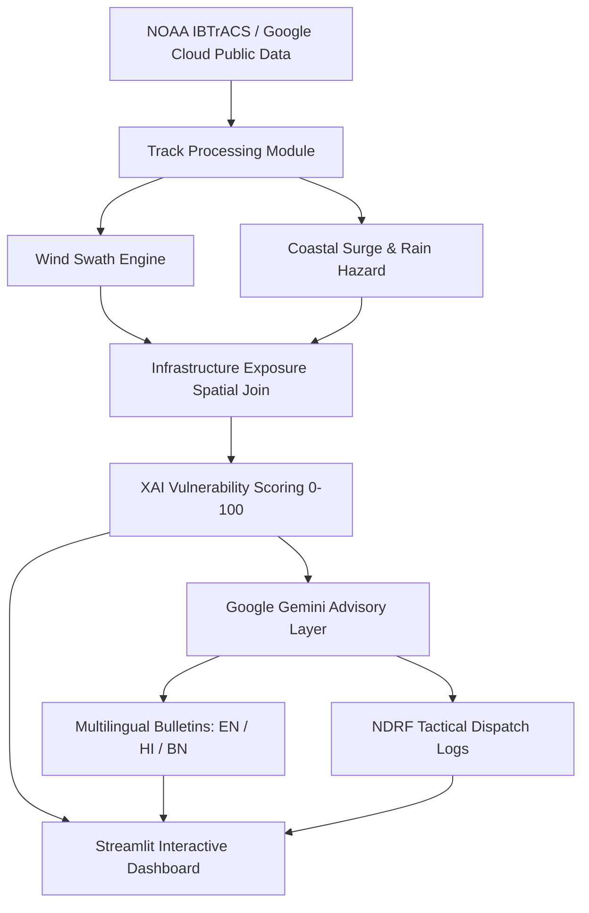

# 🌀 CycloneShield

> **Track-Based Cyclone Impact & Infrastructure Vulnerability Forecaster with Google Gemini AI**  
> *Developed for Google DevFest & Google AI Hackathon*

---

## 📌 Overview

**CycloneShield** bridges the critical **"Last-Mile Disaster Gap"** in cyclone preparedness. While meteorological models accurately predict storm tracks and atmospheric pressures, disaster response authorities (NDRF, SDMA, District Magistrates) need hyper-local, actionable answers *before* landfall:
- *Which hospitals, schools, and critical roads will be flooded?*
- *Which coastal districts face compound wind and storm surge inundation?*
- *What specific evacuation priorities, relief prepositioning, and multilingual advisories should be issued immediately?*

CycloneShield combines spatial hazard modeling with **Google Gemini AI** to produce instant, actionable disaster intelligence.

---

## 🚀 Key Features

1. **NOAA IBTrACS Track Ingestion & Processing**:
   - Ingests and cleans 3-hour synoptic cyclone tracks with interpolation and trajectory visualization.
   - Built-in historical presets (Cyclone Remal, Cyclone Dana) and custom coordinate input.

2. **Wind Swath & Dynamic Hazard Zones**:
   - Computes multi-tier wind hazard buffers (Gale ≥ 34 kts, Storm ≥ 48 kts, Hurricane ≥ 64 kts) projected using EPSG:3857/4326.

3. **Surge & Rainfall Inundation Modeling**:
   - Digital Elevation Model (SRTM) bathtub storm surge simulation.
   - Compound rainfall hazard mapping overlaid on coastal district boundaries.

4. **Critical Infrastructure Exposure Analysis**:
   - Spatial intersection with OpenStreetMap infrastructure (hospitals, bridges, shelters, schools, major road networks).
   - District-level aggregation of compromised lifelines.

5. **Explainable AI (XAI) Vulnerability Scoring**:
   - Multi-factor vulnerability index (0–100) combining wind exposure, flood depth, infrastructure density, and socioeconomic indicators with transparent feature attribution.

6. **Google Gemini Multilingual Advisory Engine**:
   - Grounded LLM reasoning powered by **Gemini 2.5 / 3.7 Flash**.
   - Structured JSON output (`response_mime_type="application/json"`).
   - Instant public safety bulletins in **English, Hindi (हिंदी), and Bengali (বাংলা)**.
   - Simulated **NDRF Incident Commander Tactical Dispatch Logs**.

7. **Interactive Command Dashboard**:
   - Built with Streamlit, styled with Google Material Design principles and typography.
   - Interactive Folium/Leaflet map layers, live charts, and real-time advisory generation.

---

## 🛠️ Architecture & Google Ecosystem Synergy



---

## 💻 Tech Stack

- **Frontend / Dashboard**: Streamlit, Folium, Streamlit-Folium, Altair, Matplotlib
- **Spatial & Data Processing**: GeoPandas, Shapely, PyProj, Pandas, NumPy
- **Generative AI**: Google Gemini API (`google-genai` / `google-generativeai`)
- **Data Standards**: GeoJSON, GeoParquet, CSV, WGS84 (EPSG:4326) / Web Mercator (EPSG:3857)

---

## ⚡ Quick Start

### 1. Clone the Repository
```bash
git clone https://github.com/<your-username>/CycloneShield.git
cd CycloneShield
```

### 2. Set Up Virtual Environment
```bash
# Windows
python -m venv cycloneshield/.venv
cycloneshield\.venv\Scripts\activate

# Linux / macOS
python3 -m venv cycloneshield/.venv
source cycloneshield/.venv/bin/activate
```

### 3. Install Dependencies
```bash
pip install -r cycloneshield/requirements.txt
```

### 4. Configure Google Gemini API Key
Obtain a free API key from [Google AI Studio](https://aistudio.google.com/):
```bash
# Windows (PowerShell)
$env:GEMINI_API_KEY="your-api-key-here"

# Linux / macOS
export GEMINI_API_KEY="your-api-key-here"
```
*(Alternatively, enter your API key directly in the dashboard sidebar).*

### 5. Launch the Dashboard
```bash
streamlit run cycloneshield/app.py
```
Or use the root launcher:
```bash
python app.py
```
Open your browser at `http://localhost:8501`.

---

## 📁 Repository Structure

```
├── cycloneshield/
│   ├── app.py                   # Main Streamlit command center dashboard
│   ├── track_input.py           # NOAA track ingestion & trajectory generator
│   ├── wind_swath.py            # Wind hazard buffer modeling
│   ├── surge_rain.py            # Elevation-based surge & rainfall inundation
│   ├── infra_exposure.py        # Infrastructure spatial intersection engine
│   ├── vuln_scoring.py          # Explainable vulnerability scoring formula
│   ├── gemini_advisory.py       # Google Gemini multilingual advisory layer
│   ├── requirements.txt         # Project dependencies
│   ├── data/                    # Datasets (IBTrACS, coastal boundaries, OSM baseline)
│   └── outputs/                 # Generated GeoJSONs, maps, and advisories
├── app.py                       # Root launcher script
├── .gitignore                   # Git ignore specifications
└── README.md                    # Project documentation
```

---

## 📜 License

This project is licensed under the Apache License 2.0. See `LICENSE` for details.
