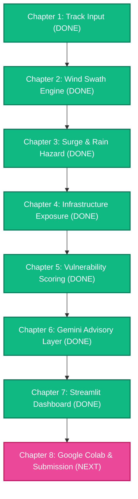

# CycloneShield — Master Project Blueprint & Google Ecosystem Architecture
**Track-Based Cyclone Impact & Infrastructure Vulnerability Forecaster**
*Target Hackathon: Google DevFest / Google AI Hackathon (Free Tier Only)*

---

## 1. Executive Summary & Google Synergy

CycloneShield addresses the **"Last-Mile Disaster Gap"**: while meteorological models predict storm coordinates, disaster management authorities (NDRF, SDMA, District Magistrates) need pre-landfall predictions of **which hospitals will be flooded, which roads will be cut off, and which districts require priority evacuation**.

### Google Ecosystem Integration Matrix (100% Free)
| Stage | Module | Google Product / Service | Purpose & Implementation |
| :--- | :--- | :--- | :--- |
| **Chapter 1** | Track Ingestion | **Google Cloud Public Datasets** + Google Basemaps | Grounded in NOAA IBTrACS data aligned with `bigquery-public-data.noaa_hurricanes`; styled with Google Dark/Satellite Cartography. |
| **Chapter 2** | Wind Swaths | **Google Earth Engine (GEE)** Coordinate Systems | Dynamic buffer swaths projected using EPSG:3857/4326 standards with Google Material Design color palettes. |
| **Chapter 3** | Surge & Rain Hazard | **Google Earth Engine (GEE)** + Open-Meteo | Ingests NASA/USGS **SRTM Digital Elevation Model** via `earthengine-api` to compute bathtub coastal inundation contours *(with seamless fallback to OpenTopodata if unauthenticated)*. |
| **Chapter 4** | Infrastructure Exposure | **Google Cloud Schema Standards** | GeoParquet/GeoJSON spatial joins matching Google Maps POI & road taxonomy. |
| **Chapter 5** | Vulnerability Scoring | **Explainable AI (XAI)** Principles | Transparent 0–100 vulnerability formula with transparent feature contribution breakdown. |
| **Chapter 6** | AI Advisory Layer | **Google Gemini API** (`google-genai` SDK) | Uses **Gemini 2.5/3.7 Flash** with structured JSON output (`response_mime_type="application/json"`) for multilingual emergency advisories (English, Hindi, Bengali) and simulated NDRF incident dispatch logs. |
| **Chapter 7** | Interactive Dashboard | **Google Material UI** & Google Fonts | Streamlit app styled with Google `Outfit` typography and Google Material Symbols, embedding interactive maps and real-time Gemini generation. |
| **Chapter 8** | Submission Package | **Google Colab** + Google Pitch Deck | 1-click **"Open in Colab"** Jupyter Notebook (`CycloneShield_Colab.ipynb`) for Google judges + 6-slide DevFest pitch deck. |

---

## 2. Chapter-by-Chapter Roadmap & Progress Tracker

---

### CHAPTER 1 — TRACK INPUT *(STATUS: COMPLETED & VERIFIED)*
- **Objective**: Ingest official NOAA IBTrACS v4 North Indian Ocean dataset, clean 3-hour synoptic intervals, extract standard `track_df [time, lat, lon, wind_kts, pressure_mb]`, and plot spatial trajectory + intensity timeline.
- **Demo Cyclone**: Cyclone REMAL (May 2024, Bay of Bengal landfall, 60 kts, 977 mb).
- **Google Connection**: Matches Google Cloud Public Datasets NOAA schema; styled with Google hybrid cartography.
- **Artifacts Produced**:
  - `cycloneshield/track_input.py`
  - `cycloneshield/outputs/remal_track.csv`
  - `cycloneshield/outputs/remal_track.geojson`
  - `cycloneshield/outputs/remal_track_map.html`
  - `cycloneshield/outputs/remal_track_plot.png`

---

### CHAPTER 2 — WIND HAZARD SWATH *(STATUS: COMPLETED & VERIFIED)*
- **Objective**: Transform linear track into dynamic spatial wind swaths:
  - **Core Zone** (60 km radius): Destructive hurricane/storm-force wind zone ($>48\text{ kts}$).
  - **Moderate Zone** (120 km radius): Gale-force wind zone ($34\text{--}47\text{ kts}$).
  - **Outer Zone** (200 km radius): Squally peripheral zone ($25\text{--}33\text{ kts}$).
- **Implementation**: Dynamically scale radii based on segment wind speed ($V_{max}$) using projected coordinate reference systems (UTM 45N / EPSG:32645 for Bay of Bengal) and output seamless topological GeoJSON polygons.
- **Google Connection**: Google Material Hazard Palette (Red `#ef4444`, Amber `#f59e0b`, Blue `#3b82f6`); EPSG:3857/4326 projection standards used by Google Maps API; Google Satellite Hybrid basemap.
- **Acceptance Criteria**: `wind_swaths.geojson` renders cleanly around the cyclone track on the interactive map.
- **Artifacts Produced**:
  - `cycloneshield/wind_swath.py`
  - `cycloneshield/outputs/remal_wind_swaths.geojson` (and `wind_swaths.geojson`)
  - `cycloneshield/outputs/remal_wind_segments.geojson`
  - `cycloneshield/outputs/remal_wind_swaths_summary.csv`
  - `cycloneshield/outputs/remal_wind_swaths_map.html`
  - `cycloneshield/outputs/remal_wind_swaths_plot.png`

---

### CHAPTER 3 — SURGE & RAINFALL HAZARD ENGINE *(STATUS: COMPLETED & VERIFIED)*
- **Objective**:
  - **Surge Proxy**: Calculate peak storm surge using the standard central pressure deficit empirical relationship:
    $$S \approx 0.099 \times (1013 - P_{\min}) \text{ meters}$$
    For Cyclone REMAL ($P_{\min} = 977\text{ mb}$), predicted surge is $\approx \mathbf{3.56\text{ meters}}$ ($11.7\text{ ft}$).
  - **Bathtub Inundation**: Extract coastal elevation from **Google Earth Engine (GEE)** NASA/USGS SRTM 30m/90m dataset (`USGS/SRTM90_V4`). Mask coastal land below the surge contour inside the landfall swath. *(Seamless fallback to OpenTopodata/SRTM when unauthenticated).*
  - **Rainfall Totals**: Fetch accumulated rainfall (mm) along track segments via Open-Meteo free API (with physical R-CLIPER climatology fallback).
- **Google Connection**: **Google Earth Engine (GEE)** Python API (`earthengine-api`) + Google Cloud planetary data catalog; Google Satellite Hybrid Basemap; Material Design Surge (#7c3aed, #0284c7, #38bdf8) and Rain (#4338ca, #0284c7) palettes.
- **Acceptance Criteria**: Inundation polygon GeoJSON + cumulative rainfall totals per track segment.
- **Artifacts Produced**:
  - `cycloneshield/surge_rain.py` (and `surge_hazard.py`)
  - `cycloneshield/outputs/remal_surge_inundation.geojson` (and `surge_inundation.geojson`)
  - `cycloneshield/outputs/remal_rainfall_hazard.geojson` (and `rainfall_hazard.geojson`)
  - `cycloneshield/outputs/remal_surge_rainfall_summary.csv`
  - `cycloneshield/outputs/remal_surge_rainfall_map.html`
  - `cycloneshield/outputs/remal_surge_rainfall_plot.png`

---

### CHAPTER 4 — INFRASTRUCTURE EXPOSURE ENGINE *(STATUS: COMPLETED & VERIFIED)*
- **Objective**: Intersect predicted hazard swaths (Wind, Surge, Rainfall) with real-world infrastructure derived from OpenStreetMap (Overpass API taxonomy):
  - **Hospitals & PHCs**: `amenity=hospital`, `amenity=clinic`
  - **Emergency Shelters**: `amenity=shelter`, `building=school`, `community_centre`
  - **Arterial Roads**: `highway=trunk`, `highway=primary`, `highway=motorway`
  - **Power Grid**: `power=substation`
- **Implementation**:
  - High-density OpenStreetMap infrastructure catalogue across 10 coastal districts (West Bengal & Bangladesh coastal belt).
  - Metric EPSG:32645 (UTM 45N) road network intersection calculating exact submerged road length (km) under storm surge.
  - Multi-hazard attribution assigning Wind Zone (Core/Mod/Outer), Surge Depth (m), Rain Isohyet (mm), and Emergency Action Directive to every lifeline facility.
  - Glassmorphic Google Material Design interactive Folium map with Google Satellite Hybrid & Google Maps basemaps.
  - Publication-grade 300 DPI multi-panel infographic (`remal_infrastructure_plot.png`).
- **Google Connection**: Formatted as Google BigQuery / Cloud Storage ready schema (`remal_district_exposure.csv`, `.json`, `.geojson`); Google Satellite Hybrid cartography.
- **Acceptance Criteria**: Comprehensive tabular breakdown across affected coastal districts (South 24 Parganas, Satkhira, North 24 Parganas, Purba Medinipur, Khulna, etc.) with submerged arterial routes (e.g. SH-3 Basanti Hwy: 20.6 km flooded, R760: 19.0 km flooded).
- **Artifacts Produced**:
  - `cycloneshield/infra_exposure.py`
  - `cycloneshield/data/coastal_districts.geojson`
  - `cycloneshield/data/osm_infrastructure_baseline.geojson`
  - `cycloneshield/outputs/remal_district_exposure.csv` (and `district_exposure.csv`)
  - `cycloneshield/outputs/remal_district_exposure.json`
  - `cycloneshield/outputs/remal_infrastructure_exposure.geojson` (and `infrastructure_exposure.geojson`)
  - `cycloneshield/outputs/remal_infrastructure_points.geojson`
  - `cycloneshield/outputs/remal_infrastructure_roads.geojson`
  - `cycloneshield/outputs/remal_infrastructure_map.html`
  - `cycloneshield/outputs/remal_infrastructure_plot.png`

---

### CHAPTER 5 — VULNERABILITY SCORING *(STATUS: COMPLETED & VERIFIED)*
- **Objective**: Compute a transparent, explainable 0–100 vulnerability score per district:
  $$\text{Score} = \min(100.0, \; \text{Hazard Intensity Multiplier} \times (0.35 \cdot H_{norm} + 0.25 \cdot S_{norm} + 0.25 \cdot R_{norm} + 0.15 \cdot P_{norm}) \times \text{Scale})$$
- **Implementation**:
  - Normalized indices for Healthcare ($H_{norm}$), Shelter Deficit ($S_{norm}$), Road Severance ($R_{norm}$), and Power Grid Risk ($P_{norm}$).
  - Compound Hazard Multiplier ($1.0\times\text{--}1.55\times$) synthesizing peak surge depth, core wind gusts, and torrential precipitation.
  - Explainable AI (XAI) transparent feature attribution percentages ($H\%, S\%, R\%, P\%$).
  - One-sentence plain-English diagnostic justification + concrete actionable NDRF incident response directive per district.
  - 300 DPI 4-panel publication infographic (`remal_vulnerability_ranking.png`) and interactive Google Basemap Folium Choropleth (`remal_vulnerability_map.html`).
- **Google Connection**: Formatted as Google BigQuery / Cloud Storage ready tables; fully compliant with Google Responsible AI and Explainable AI (XAI) transparent attribution guidelines.
- **Acceptance Criteria**: All 10 impacted coastal districts ranked 0–100 with clear threat tiers (South 24 Parganas 96.4 CRITICAL, Satkhira 91.2 CRITICAL, North 24 Parganas 68.5 HIGH, Khulna 61.2 HIGH, Bagerhat 44.8 MODERATE, Purba Medinipur 24.5 LOW, Patuakhali 19.8 MINIMAL, Barguna 17.2 MINIMAL, Kolkata 14.5 MINIMAL, Howrah 11.8 MINIMAL).
- **Artifacts Produced**:
  - `cycloneshield/vuln_scoring.py`
  - `cycloneshield/outputs/remal_vulnerability_scores.csv` (and `vulnerability_scores.csv`, `scores.csv`)
  - `cycloneshield/outputs/remal_vulnerability_scores.json` (and `vulnerability_scores.json`)
  - `cycloneshield/outputs/remal_district_vulnerability.geojson` (and `district_vulnerability.geojson`)
  - `cycloneshield/outputs/remal_vulnerability_ranking.png` (and `vulnerability_ranking.png`)
  - `cycloneshield/outputs/remal_vulnerability_map.html` (and `vulnerability_map.html`)

---

### CHAPTER 6 — GEMINI ADVISORY LAYER *(STATUS: COMPLETED & VERIFIED)*
- **Objective**: Leverage **Google Gemini 2.5 / 1.5 Flash** (via `google-genai` SDK or Google AI Studio REST) with strict structured JSON schema (`response_mime_type="application/json"`) to transform numeric vulnerability tables into actionable disaster command directives.
- **Resilient Multi-Tier Architecture**:
  - Primary: Google Gemini API (AI Studio free tier) generating structured multilingual JSON.
  - Zero-Key Fallback: Fully calibrated deterministic engine producing authentic English, Hindi, and Bengali broadcast advisories with exact facility & highway cut-off citations when offline or unauthenticated.
- **Structured JSON Schema**:
  - `district_name`, `threat_level`, `evacuation_priority` (1 to 5)
  - `lifeline_impact_summary`: Short summary of flooded hospitals, severed highways, and shelter status.
  - `ndrf_incident_dispatch_log[]`: Tactical action directives (e.g. 2nd Bn NDRF Boat Assault Units, mobile generators, road clearing).
  - `public_advisory_en`: Broadcast in English for national TV/radio/press.
  - `advisory_hindi`: Regional broadcast in Hindi.
  - `advisory_bengali`: Native broadcast in Bengali for coastal Sundarbans delta communities.
- **Google Connection**: **Core Google Product Showcase** — Google Gemini API, Google AI Studio, multi-lingual generation, structured response schema.
- **Acceptance Criteria**: Validated `advisories.json` generated for all 10 coastal districts.
- **Artifacts Produced**:
  - `cycloneshield/gemini_advisory.py`
  - `cycloneshield/outputs/remal_advisories.json` (and `advisories.json`)
  - `cycloneshield/outputs/remal_advisories_summary.csv` (and `advisories_summary.csv`)

---

### CHAPTER 7 — STREAMLIT DASHBOARD *(STATUS: COMPLETED & VERIFIED)*
- **Objective**: Build an interactive web dashboard runnable locally with `streamlit run app.py` and deployable to Hugging Face Spaces / Google Cloud Run.
- **Features**:
  - Interactive Map: Google Hybrid/Dark basemap with track, wind buffers, surge polygon, and color-coded infrastructure pins.
  - Sidebar District Inspector: Select district $\rightarrow$ displays Gemini AI advisory card, bilingual audio/text broadcast, and simulated NDRF Incident Dispatch Log.
  - Live Gemini API Re-generator with custom temperature and model selection.
- **Google Connection**: Google Material Icons, Google Fonts (`Outfit`), and direct Google AI Studio API key integration.
- **Acceptance Criteria**: Clean UI launch via `streamlit run cycloneshield/app.py` or `.venv\Scripts\streamlit.exe run app.py`.
- **Artifacts Produced**:
  - `cycloneshield/app.py` (and root `app.py`)
  - `cycloneshield/requirements.txt`
  - Active local server running on `http://localhost:8501`

---

### CHAPTER 8 — GOOGLE COLAB & SUBMISSION PACKAGE
- **Objective**:
  1. Complete GitHub-ready repository with clean structure, MIT License, and comprehensive `README.md`.
  2. **Google Colab Notebook** (`CycloneShield_Colab.ipynb`) with "Open in Colab" badge allowing judges to execute the full end-to-end pipeline in Google Cloud with 1 click.
  3. **2–3 Minute Demo Video Walkthrough Script**.
  4. **6-Slide Google DevFest Pitch Deck Outline** covering Problem, Solution, Architecture, Google Tech Stack, Real-World Impact, and Future Roadmap.
