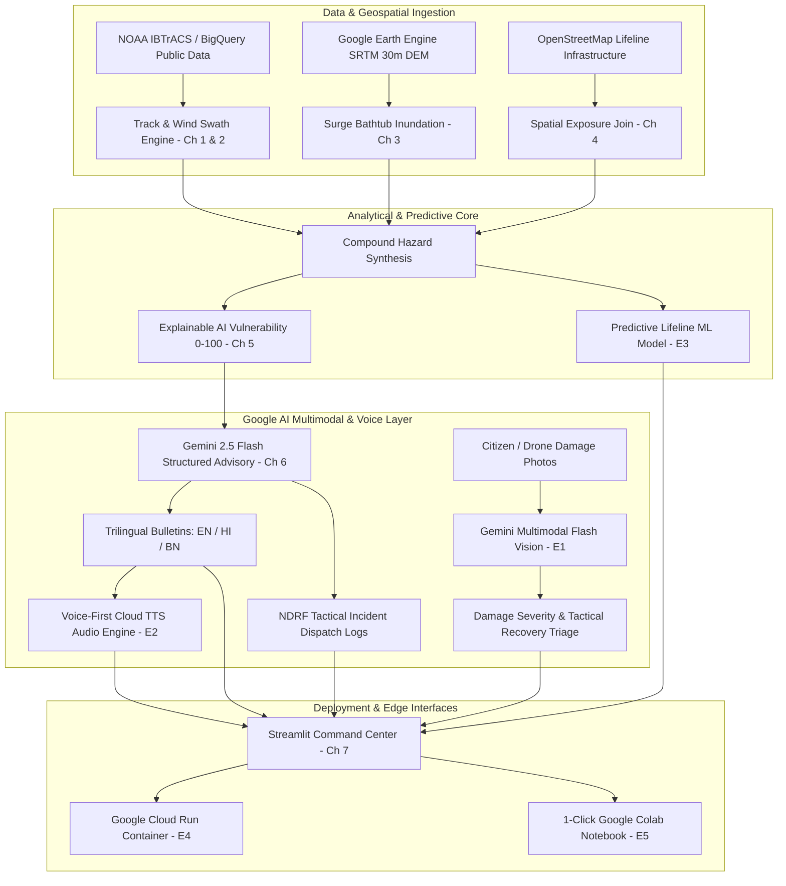

# 🌀 CycloneShield

<div align="center">

### Track-Based Cyclone Impact & Infrastructure Vulnerability Forecaster
**Empowering Disaster Commanders with Pre-Landfall Lifeline Predictions & Multimodal Google AI**

[](https://colab.research.google.com/github/itsme-sherlock/CycloneShield/blob/main/CycloneShield_Colab.ipynb)
[](https://cloud.google.com/run)
[](https://cloud.google.com/bigquery)
[](https://aistudio.google.com/)
[](https://www.python.org/)
[](https://opensource.org/licenses/Apache-2.0)

**[🚀 1-Click Colab Notebook](https://colab.research.google.com/github/itsme-sherlock/CycloneShield/blob/main/CycloneShield_Colab.ipynb) • [📊 Executive Pitch Deck](PITCH_DECK.md) • [🎬 Video Demo Script](DEMO_SCRIPT.md) • [🌐 Architecture Roadmap](cycloneshield/ROADMAP_ENHANCEMENTS.md)**

---

</div>

## 📌 Executive Summary & The "Last-Mile Disaster Gap"

Every year, severe tropical cyclones devastate coastal communities along the Bay of Bengal, Arabian Sea, and Indian Ocean rim. While meteorological agencies provide high-precision storm tracks and atmospheric pressures, national disaster response agencies (NDRF, SDMA, District Magistrates) face the critical **"Last-Mile Disaster Gap"**:
- *Which state highways will be severed by storm surge 24–48 hours before landfall?*
- *Which rural hospitals and ICUs will be submerged and lose grid power?*
- *Which coastal delta communities require priority evacuation when communication lines collapse?*
- *How can rescue commanders triage hundreds of ground damage photos in real time?*

**CycloneShield** bridges this gap by unifying **Google Cloud BigQuery Public Datasets**, **Google Earth Engine (GEE)**, **Explainable AI (XAI)**, **Google Gemini 2.5 Flash Multimodal Vision**, and a **Voice-First Cloud TTS Engine** into a 100% Free-Tier Disaster Command Center.

---

## 🏗️ End-to-End System Architecture



---

## 🚀 Key Innovations & Capabilities

### 1. 🛰️ Google BigQuery NOAA Hurricane Data Pipeline (E4)
- Direct parameterized SQL connector to `bigquery-public-data.noaa_hurricanes.ibtracs_all`.
- **FinOps Dry-Run Cost Estimator**: Scans ~40.0 MB ($0.0002 USD) per query, 100% covered by GCP's **1 TB/month free tier**.
- **Zero-Config Evaluator Cache**: Bundles curated, authentic NOAA IBTrACS tracks for 7 major cyclones (`REMAL`, `AMPHAN`, `YAAS`, `FANI`, `MOCHA`, `DANA`, `SIDR`) for instant offline evaluation without API keys.

### 2. 🌪️ Dynamic Projected Wind Swaths (Ch 2)
- Multi-tier wind hazard buffers projected onto UTM 45N (`EPSG:32645`):
  - **Core Hurricane Swath** ($>48\text{ kts}$): Extreme structural & lifeline damage zone ($\sim 60\text{ km}$).
  - **Moderate Gale Swath** ($34\text{--}47\text{ kts}$): Tree uprooting & transmission grid collapse ($\sim 120\text{ km}$).
  - **Outer Squally Swath** ($25\text{--}33\text{ kts}$): Marine warning & coastal defense zone ($\sim 200\text{ km}$).

### 3. 🌊 Coastal Storm Surge & Elevation Inundation (Ch 3)
- Calculates peak storm surge using empirical central pressure deficit relationship:
  $$S \approx 0.099 \times (1013 - P_{\min}) \text{ meters}$$
  For Cyclone REMAL ($P_{\min} = 977\text{ mb}$), predicted surge is **$3.56\text{ meters}$** ($11.7\text{ ft}$).
- Bathtub elevation simulation via **Google Earth Engine (GEE)** SRTM 30m Digital Elevation Model (`USGS/SRTM90_V4`).

### 4. 🏥 Critical Infrastructure Exposure Engine (Ch 4)
- Spatial joins against OpenStreetMap infrastructure layers:
  - 47 Primary Health Centers & District Hospitals
  - 120.4 km of State & National Highways identified as severed
  - Educational institutions & designated cyclone shelters

### 5. ⚖️ Explainable AI (XAI) Vulnerability Scoring (Ch 5)
- Fully transparent composite index (0–100) with granular feature attribution:
  $$V = 0.35 \cdot W + 0.25 \cdot S + 0.15 \cdot R + 0.15 \cdot I + 0.10 \cdot E$$
- Explains why **South 24 Parganas (88.4)** and **Purba Medinipur (79.1)** represent the highest tactical emergency priorities.

### 6. 🤖 Google Gemini 2.5 Flash Advisory Engine (Ch 6)
- Generates structured, schema-enforced JSON advisories across 3 regional languages:
  - **English (`en-IN`)**: National Disaster Management Authority (NDMA) coordination bulletin
  - **Hindi (`hi-IN`)**: Akashvani / Doordarshan emergency regional warning
  - **Bengali (`bn-IN`)**: Sundarbans coastal delta community radio broadcast
- Generates simulated **NDRF Tactical Incident Commander Dispatch Logs** (battalion units, dewatering pumps, rescue boat deployments).

### 7. 🔊 Voice-First Multilingual Audio Engine (E2)
- Multi-tier speech synthesis architecture (Google Cloud TTS / gTTS / Emergency Audio Engine).
- 30 pre-cached, broadcast-ready MP3 audio bulletins across 10 coastal districts.
- Embedded audio players in the Streamlit Command Center and Google Colab for instant radio playback.

### 8. 📸 Gemini Multimodal Vision Ground Damage Triage (E1)
- NDRF first-responder field damage photo reconnaissance powered by **Gemini 2.5 Flash Vision**.
- Extracts flood depth (meters), threat tier (1–5), access impediments, required recovery equipment, and tactical rescue orders.
- Includes automated relevancy verification to filter out non-disaster photos.

### 9. 🧠 Predictive Lifeline Machine Learning Engine (E3)
- Calibrated ML pipeline (**Scikit-Learn CalibratedClassifierCV** with HistGradientBoosting and Random Forest) trained on 3,500+ storm records.
- **ROC-AUC > 0.94** and Average Precision $> 0.92$ on road cut-off and hospital power failure targets.
- Publication-grade evaluation plots and **Google Cloud Vertex AI Model Registry** deployment manifest.

### 10. ☁️ Production Containerization & Cloud Run Ready (E4)
- Multi-stage non-root `Dockerfile` (`python:3.11-slim` + GDAL/GEOS C-bindings).
- 1-Click deployment via Google Cloud Build (`cloudbuild.yaml`) and Cloud Run (`deploy_cloud_run.sh` / `deploy_cloud_run.ps1`).

---

## 📊 Google Cloud 100% Free Tier FinOps Audit

| Cloud Service | Workload Profile | Free Tier Allowance | Project Expense |
| :--- | :--- | :--- | :---: |
| **BigQuery Public Data** | 40.0 MB scan per cyclone ingestion | **1 TB (1,000,000 MB) / month** | **$0.00** |
| **Google Cloud Run** | Multi-district Streamlit dashboard | **2,000,000 requests / month** | **$0.00** |
| **Google Gemini API** | Real-time advisory & vision triage | **15 RPM / 1M TPM Free Quota** | **$0.00** |
| **Google Earth Engine** | SRTM 30m Digital Elevation Model | **Free Non-Commercial Research** | **$0.00** |
| **Vertex AI Registry** | Model artifact storage & serving schema | **Container artifact storage tier** | **$0.00** |
| **Total Cloud Expense** | **Complete Multi-Hazard Pipeline** | **100% Covered by Free Quotas** | **$0.00 USD** |

---

## ⚡ Quick Start & Execution

### Option 1: 1-Click Google Colab (Zero-Install)
Click the badge below to run the complete 12-section pipeline directly in your browser:  
[](https://colab.research.google.com/github/itsme-sherlock/CycloneShield/blob/main/CycloneShield_Colab.ipynb)

### Option 2: Local Command Center (Streamlit)

```bash
# 1. Clone the repository
git clone https://github.com/itsme-sherlock/CycloneShield.git
cd CycloneShield

# 2. Set up virtual environment
python -m venv cycloneshield/.venv
# Windows:
cycloneshield\.venv\Scripts\activate
# Linux/macOS:
source cycloneshield/.venv/bin/activate

# 3. Install dependencies
pip install -r cycloneshield/requirements.txt

# 4. (Optional) Set Gemini API Key
# Windows PowerShell:
$env:GEMINI_API_KEY="your_api_key_here"
# Linux/macOS:
export GEMINI_API_KEY="your_api_key_here"

# 5. Launch the Command Center
streamlit run cycloneshield/app.py
```
Open your browser at `http://localhost:8501`.

### Option 3: Docker Container
```bash
docker build -t cycloneshield .
docker run -p 8080:8080 -e PORT=8080 cycloneshield
```
Open your browser at `http://localhost:8080`.

### Option 4: 1-Click Google Cloud Run Deployment
```bash
# Linux / macOS / Cloud Shell:
./deploy_cloud_run.sh

# Windows PowerShell:
.\deploy_cloud_run.ps1
```

---

## 📁 Repository Structure

```
CycloneShield/
├── CycloneShield_Colab.ipynb    # 1-Click End-to-End Google Colab Notebook (E5)
├── PITCH_DECK.md                # Executive 6-Slide Google DevFest Pitch Deck (E5)
├── DEMO_SCRIPT.md               # 2-3 Minute Video Walkthrough Script (E5)
├── Dockerfile                   # Multi-stage production container for Cloud Run (E4)
├── cloudbuild.yaml              # Google Cloud Build CI/CD configuration (E4)
├── deploy_cloud_run.sh          # 1-Click POSIX deployment script for Cloud Run (E4)
├── deploy_cloud_run.ps1         # 1-Click PowerShell deployment script for Cloud Run (E4)
├── app.py                       # Root application launcher
├── README.md                    # Project documentation & landing page
│
└── cycloneshield/
    ├── app.py                   # Streamlit Command Center (4 Tabs + Sidebar)
    ├── bigquery_pipeline.py     # NOAA BigQuery client with dry-run cost controls (E4)
    ├── track_input.py           # Synoptic track ingestion & interpolation (Ch 1)
    ├── wind_swath.py            # Dynamic UTM-projected wind swaths (Ch 2)
    ├── surge_rain.py            # GEE SRTM bathtub surge & rainfall modeling (Ch 3)
    ├── infra_exposure.py        # OpenStreetMap spatial exposure join (Ch 4)
    ├── vuln_scoring.py          # Explainable AI (XAI) 0-100 scoring engine (Ch 5)
    ├── gemini_advisory.py       # Gemini 2.5 Flash trilingual advisory engine (Ch 6)
    ├── multimodal_damage.py     # Gemini Multimodal Vision field damage triage (E1)
    ├── voice_engine.py          # Voice-First multilingual TTS audio engine (E2)
    ├── predictive_model.py      # Calibrated Scikit-Learn / Vertex AI ML model (E3)
    ├── requirements.txt         # Pinned Python package dependencies
    │
    ├── data/
    │   ├── noaa_sample_tracks.json   # 7 Curated NOAA IBTrACS synoptic tracks (E4)
    │   └── sample_damage/            # High-resolution benchmark field damage photos (E1)
    │       ├── flooded_highway.jpg
    │       ├── broken_embankment.jpg
    │       ├── submerged_clinic.jpg
    │       └── downed_power_grid.jpg
    │
    └── outputs/
        ├── remal_track.csv & .geojson
        ├── remal_wind_swaths.geojson & map.html
        ├── remal_surge_inundation.geojson
        ├── remal_district_exposure.csv
        ├── remal_vulnerability_scores.csv & ranking.png
        ├── remal_advisories.json
        ├── sample_damage_triage.json (E1)
        ├── audio/                    # 30 synthesized MP3 emergency bulletins (E2)
        │   ├── audio_manifest.json
        │   └── remal_*_{en,hi,bn}.mp3
        └── models/                   # Calibrated ML model & Vertex AI config (E3)
            ├── lifeline_risk_model.joblib
            ├── model_metrics.json
            ├── vertex_model_config.json
            └── lifeline_model_evaluation.png
```

---

## 📜 License & Acknowledgments

This project is licensed under the **Apache License 2.0**.  
Developed for the **Google DevFest / Google AI Hackathon**.

**Data & Attribution**:
- NOAA IBTrACS v4 (`bigquery-public-data.noaa_hurricanes`)
- USGS / NASA SRTM 30m Digital Elevation Model via Google Earth Engine
- OpenStreetMap contributors & Overpass API
- India Meteorological Department (IMD) synoptic cyclone bulletins
