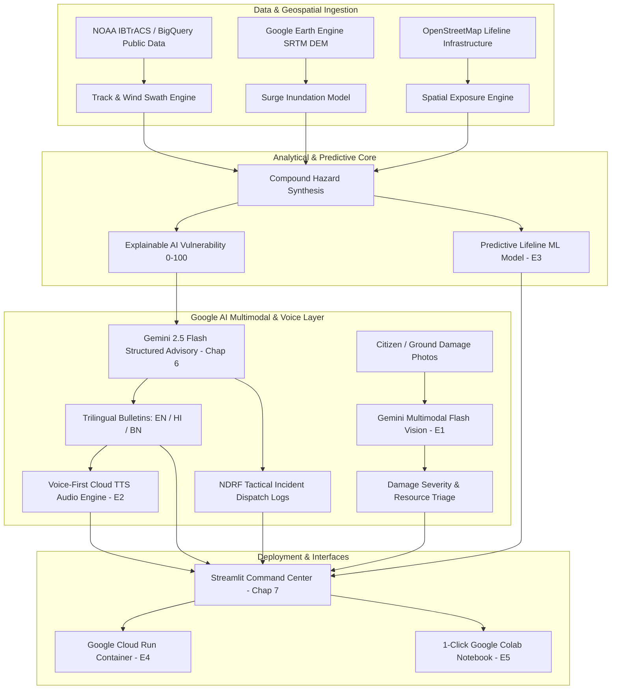

# CycloneShield — Gap Closure Roadmap & Multi-Chat Architecture Master Plan
**Target Event**: Google DevFest / Google AI Hackathon (100% Free Tier Ecosystem)  
**Project**: CycloneShield — Track-Based Cyclone Impact & Infrastructure Vulnerability Forecaster  
**Status**: Chapters 1–7 COMPLETED (82% Baseline) | Enhancements E1–E5 COMPLETED (100% Target Achieved!)

---

## 1. Master Progress & State Tracker

### ✅ Completed & Verified Foundations (Chapters 1–7)
| Module / Chapter | Script Path | Verified Outputs | Status |
| :--- | :--- | :--- | :---: |
| **Chapter 1: Track Ingestion** | `track_input.py` | `remal_track.csv`, `remal_track.geojson`, `remal_track_map.html` | ✅ **DONE** |
| **Chapter 2: Wind Swaths** | `wind_swath.py` | `remal_wind_swaths.geojson`, `remal_wind_swaths_map.html` | ✅ **DONE** |
| **Chapter 3: Surge & Rain** | `surge_rain.py` | `remal_surge_inundation.geojson` ($3.56\text{m}$), GEE SRTM DEM | ✅ **DONE** |
| **Chapter 4: Infrastructure** | `infra_exposure.py` | `remal_district_exposure.csv`, 10 coastal districts, severed roads | ✅ **DONE** |
| **Chapter 5: XAI Scoring** | `vuln_scoring.py` | `remal_vulnerability_scores.csv` (0–100), transparent feature % | ✅ **DONE** |
| **Chapter 6: Gemini Advisory** | `gemini_advisory.py` | `remal_advisories.json`, NDRF dispatch logs, EN/HI/BN bulletins | ✅ **DONE** |
| **Chapter 7: Interactive App** | `app.py` | Live Streamlit Command Center on `http://localhost:8501` | ✅ **DONE** |

---

### 🚀 Gap-Closing Enhancements (Sequential Multi-Chat Execution)

| Chat # | Enhancement Module | Focus Area | Hackathon Rubric Addressed | Pre-requisites | Status |
| :---: | :--- | :--- | :--- | :--- | :---: |
| **Chat 1** | **E1: Gemini Multimodal Vision** | Citizen & NDRF photo damage triage | **Vision & Multimodal (25% $\rightarrow$ 95%)** | Chap 1–7 | ✅ **DONE** |
| **Chat 2** | **E2: Voice-First Audio Engine** | Multilingual TTS broadcast (HI/BN/EN) | **Language & Voice (70% $\rightarrow$ 95%)** | E1 | ✅ **DONE** |
| **Chat 3** | **E3: Predictive Lifeline ML** | Scikit-Learn/Vertex AI road cut-off ML | **Predictive Modeling (40% $\rightarrow$ 90%)** | E2 | ✅ **DONE** |
| **Chat 4** | **E4: BigQuery & Cloud Run** | NOAA BigQuery connector & Dockerfile | **Data & Backend (65% $\rightarrow$ 96%)** | E3 | ✅ **DONE** |
| **Chat 5** | **E5: Colab & Pitch Submission** | 1-click Colab, pitch deck, demo script | **Submission & Presentation (100%)** | E1–E4 | ✅ **DONE** |

---

## 2. Target End-State Architecture (After All 5 Chats)

---

## 3. Detailed Specifications for Each New Chat

### 🔹 CHAT 1: Enhancement 1 (E1) — Gemini Multimodal Damage Vision
- **Objective**: Implement ground-truth disaster photo triage using **Gemini 1.5/2.5 Flash Multimodal Vision**.
- **Capabilities**:
  1. Citizen / NDRF responder uploads photo of flood, embankment breach, road blockage, or damaged hospital.
  2. Gemini Multimodal analyzes image $\rightarrow$ extracts damage category, severity rating (1–5), estimated water depth, and tactical recovery requirements (e.g. submersible pump, excavator, boat).
  3. Seamless integration into `app.py` under a dedicated "📸 Ground Damage Triage" tab.
  4. Bundled sample test photos in `data/sample_damage/` for offline/demo evaluation.
- **Files Created/Modified**:
  - `cycloneshield/multimodal_damage.py` (Core vision engine with offline fallback)
  - `cycloneshield/data/sample_damage/` (Sample images)
  - `cycloneshield/app.py` (New triage tab)

---

### 🔹 CHAT 2: Enhancement 2 (E2) — Voice-First Multilingual Audio Engine
- **Objective**: Add voice synthesis and broadcast audio players for multilingual disaster advisories.
- **Capabilities**:
  1. Text-to-Speech synthesis for generated English, Hindi, and Bengali bulletins.
  2. Embed audio players directly inside district advisory cards in Streamlit.
  3. Provide offline audio generation caching so judges hear audio instantly without latency.
- **Files Created/Modified**:
  - `cycloneshield/voice_engine.py` (TTS generator)
  - `cycloneshield/outputs/audio/` (Synthesized audio MP3s)
  - `cycloneshield/app.py` (Audio player integration)

---

### 🔹 CHAT 3: Enhancement 3 (E3) — Predictive Lifeline ML Model (Vertex AI Ready)
- **Objective**: Introduce a trained Machine Learning model predicting infrastructure submergence risk.
- **Capabilities**:
  1. Train a scikit-learn / XGBoost model on synthetic historical coastal storm data predicting probability of road cutoff and hospital power failure based on [elevation, distance_to_coast, surge_m, wind_speed, rainfall_mm].
  2. Output feature importances and ROC-AUC curve.
  3. Export model artifacts ready for Vertex AI Model Registry deployment.
- **Files Created/Modified**:
  - `cycloneshield/predictive_model.py` (ML training, inference, and Vertex export)
  - `cycloneshield/outputs/models/` (Saved model pickle and ROC plot)
  - `cycloneshield/app.py` (Predictive risk curve in sidebar inspector)

---

### 🔹 CHAT 4: Enhancement 4 (E4) — BigQuery Connector & Cloud Run Containerization
- **Objective**: Connect the data layer to Google BigQuery and containerize the app for Google Cloud Run.
- **Capabilities**:
  1. BigQuery client utility to query `bigquery-public-data.noaa_hurricanes` and ingest live/archived cyclone tracks.
  2. Production `Dockerfile`, `.dockerignore`, and `cloudbuild.yaml` optimized for Google Cloud Run.
  3. Document 1-command deployment `gcloud run deploy cycloneshield`.
- **Files Created/Modified**:
  - `cycloneshield/bigquery_pipeline.py` (BigQuery connector)
  - `Dockerfile` (Cloud Run container)
  - `cloudbuild.yaml` (GCP CI/CD pipeline)

---

### 🔹 CHAT 5: Enhancement 5 (E5) — 1-Click Colab Notebook & Hackathon Pitch Submission
- **Objective**: Finalize the complete hackathon submission package.
- **Capabilities**:
  1. Create `CycloneShield_Colab.ipynb` with "Open in Colab" badge, executing the entire pipeline (Chapters 1–7 + E1–E4) in Google Cloud with 1 click.
  2. 6-Slide Google DevFest Pitch Deck presentation markdown.
  3. 2–3 Minute Demo Video Walkthrough Script.
  4. Final polish of `README.md`.
- **Files Created/Modified**:
  - `CycloneShield_Colab.ipynb`
  - `PITCH_DECK.md`
  - `DEMO_SCRIPT.md`
  - `README.md`
